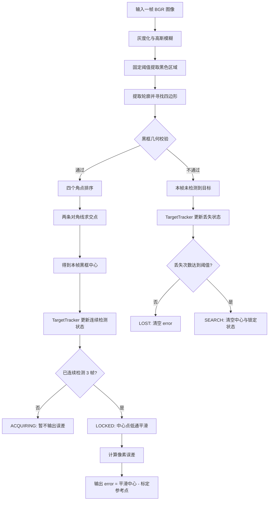

# 当前已完成的视觉流程

```mermaid
flowchart TD
    A[输入一帧 BGR 图像] --> B[灰度化与高斯模糊]
    B --> C[固定阈值提取黑色区域]
    C --> D[提取轮廓并寻找四边形]
    D --> E{黑框几何校验}

    E -- 不通过 --> F[本帧未检测到目标]
    F --> G[TargetTracker 更新丢失状态]

    E -- 通过 --> H[四个角点排序]
    H --> I[两条对角线求交点]
    I --> J[得到本帧黑框中心]
    J --> K[TargetTracker 更新连续检测状态]

    K --> L{已连续检测 3 帧?}
    L -- 否 --> M[ACQUIRING: 暂不输出误差]
    L -- 是 --> N[LOCKED: 中心点低通平滑]
    N --> O[计算像素误差]
    O --> P[输出 error = 平滑中心 - 标定参考点]

    G --> Q{丢失次数达到阈值?}
    Q -- 否 --> R[LOST: 清空 error]
    Q -- 是 --> S[SEARCH: 清空中心与锁定状态]
```

## 当前输出

- `center`：经过低通平滑后的黑框中心像素坐标。
- `error`：仅在 `LOCKED` 状态下输出的 `(x_error, y_error)`；目标丢失或尚未锁定时为 `None`。

> 图中仅包含已经实现并测试的视觉检测与跟踪逻辑，不包含 TTL 串口、电机控制或云台方案。
